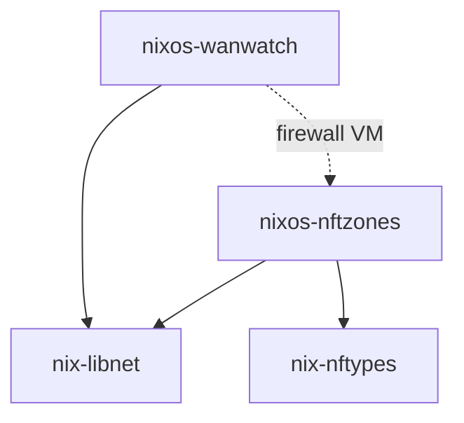

# Project normalization audit

Evidence gathered on 2026-09-16 for the [normalization design](normalization-design.md). This is a snapshot of project state and upstream documentation, not the family policy.

## Evidence and limits

The inventory examines the local project checkouts and committed configuration. It does not establish that configured checks currently pass. GitHub enforcement settings, remote tags, and releases were subsequently inspected through read-only APIs. Dependency updates and builds are outside this discovery pass.

### Development environment

Only three projects have `.envrc`, and four have a default development shell. None explicitly supplies `nil` or `nixd` in its declared development packages. Tool availability, locally installed hooks, and checks actually executed by CI differ.

| Project            | Shell and activation                               | Tooling and check observations                                                                                                                                                                                                                                                                                                                                                                                                                                                                                                                                                             |
| ------------------ | -------------------------------------------------- | ------------------------------------------------------------------------------------------------------------------------------------------------------------------------------------------------------------------------------------------------------------------------------------------------------------------------------------------------------------------------------------------------------------------------------------------------------------------------------------------------------------------------------------------------------------------------------------------ |
| nix-libnet         | Default shell; `use flake`                         | Nix, nixfmt-tree, statix, deadnix. Nix linters are deliberately advisory. [Configuration](https://github.com/petohorvath/nix-libnet/blob/a6e132cd5749e4756720c4786878340ed95a1328/flake.nix), [CI](https://github.com/petohorvath/nix-libnet/blob/a6e132cd5749e4756720c4786878340ed95a1328/.github/workflows/ci.yml).                                                                                                                                                                                                                                                                      |
| nix-nftypes        | Linux `review` shell; no default shell or `.envrc` | Review shell supplies nftables and util-linux and assumes a host Nix executable. CI runs flake checks and formatting. Parser checks need Linux namespaces. [Configuration](https://github.com/petohorvath/nix-nftypes/blob/b3ac0b4af9cfdf11595de817d4e1f22c309395a9/flake.nix), [CI](https://github.com/petohorvath/nix-nftypes/blob/b3ac0b4af9cfdf11595de817d4e1f22c309395a9/.github/workflows/ci.yml).                                                                                                                                                                                   |
| nixos-cross-config | No shell or `.envrc`; separate `dev/` flake        | Consumer flake has no inputs. Development flake supplies formatting and stable/unstable evaluation checks. No checked-in GitHub Actions workflows found. [Consumer flake](https://github.com/petohorvath/nixos-cross-config/blob/79337a8f48a038fdc742f951b430b54f646936b3/flake.nix), [development flake](https://github.com/petohorvath/nixos-cross-config/blob/79337a8f48a038fdc742f951b430b54f646936b3/dev/flake.nix).                                                                                                                                                                  |
| nixos-nftzones     | Default shell; `use flake`                         | Nix, nixfmt-tree, nftables, statix, deadnix, nix-output-monitor. Nix linters remain manual. CI includes unit, integration, example, and VM checks. [Configuration](https://github.com/petohorvath/nixos-nftzones/blob/c37a1692de8268fb3facbab15a06e3f58f3b20a1/flake.nix), [CI](https://github.com/petohorvath/nixos-nftzones/blob/c37a1692de8268fb3facbab15a06e3f58f3b20a1/.github/workflows/ci.yml).                                                                                                                                                                                     |
| nixos-registry     | No shell or `.envrc`; separate `dev/` flake        | Consumer flake has no required inputs. Development flake supplies stable/unstable checks and bare nixfmt; formatting instructions require manual file globs. No checked-in GitHub Actions workflows found. [Consumer flake](https://github.com/petohorvath/nixos-registry/blob/c7009f558c19ff7cc63e3d99529026397c4c7a6c/flake.nix), [development flake](https://github.com/petohorvath/nixos-registry/blob/c7009f558c19ff7cc63e3d99529026397c4c7a6c/dev/flake.nix), [instructions](https://github.com/petohorvath/nixos-registry/blob/c7009f558c19ff7cc63e3d99529026397c4c7a6c/README.md). |
| nixos-shields      | Default shell; no `.envrc`                         | Wrapped Nix, nixfmt-tree, statix, deadnix, shellcheck, rage. Nix and its plugin deliberately share an ABI version. CI runs formatting and flake checks on x86_64 Linux. [Shell](https://github.com/petohorvath/nixos-shields/blob/12023d7fa97b9ab9fef32edede335bd4e4c9ccb4/parts/dev-shells.nix), [Nix wrapper](https://github.com/petohorvath/nixos-shields/blob/12023d7fa97b9ab9fef32edede335bd4e4c9ccb4/lib/mk-nix.nix), [CI](https://github.com/petohorvath/nixos-shields/blob/12023d7fa97b9ab9fef32edede335bd4e4c9ccb4/.github/workflows/ci.yml).                                     |
| nixos-wanwatch     | Default, audit, and review shells; `use flake`     | Default shell includes Go tools, treefmt, statix, and deadnix, but no Nix executable. CI builds selected checks and does not execute the exposed pre-commit lint check or the configured golangci-lint hook. [Configuration](https://github.com/petohorvath/nixos-wanwatch/blob/ae441613bca737dcb224ac2fef94534089404c19/flake.nix), [CI](https://github.com/petohorvath/nixos-wanwatch/blob/ae441613bca737dcb224ac2fef94534089404c19/.github/workflows/ci.yml).                                                                                                                           |

All seven projects use a nixfmt-based formatter, through different wrappers and entrypoints. No common Markdown/YAML formatting or lint gate was found. Declared platform outputs differ from CI coverage: several projects declare Darwin outputs, while all discovered CI execution uses Linux. NixOS VM tests and nftables parser tests also have host capability requirements that development packages alone cannot satisfy.

Three local Git configurations point `core.hooksPath` at directories outside the current workspace that no longer exist: nix-libnet, nixos-nftzones, and nixos-wanwatch. This is a local checkout finding; a portable policy cannot rely on the current hook installation state.

### Dependency boundaries

No inter-project cycle was observed in the seven current checkouts. All eight recorded primary lock graphs are acyclic after resolving `follows`. This covers declared flake inputs and inspected source imports; it does not prove the behavior of arbitrary caller-supplied modules or source code at older locked revisions.

Cross-config and registry expose separate constructors that receive caller-owned arguments. Neither currently imports the other. Their dependency-free consumer flakes and separate development flakes are an existing architectural choice to account for when sharing tooling. See [cross-config's entrypoint](https://github.com/petohorvath/nixos-cross-config/blob/79337a8f48a038fdc742f951b430b54f646936b3/flake.nix), [its constructor](https://github.com/petohorvath/nixos-cross-config/blob/79337a8f48a038fdc742f951b430b54f646936b3/lib/mk-module.nix), [registry's entrypoint](https://github.com/petohorvath/nixos-registry/blob/c7009f558c19ff7cc63e3d99529026397c4c7a6c/flake.nix), and [its constructor](https://github.com/petohorvath/nixos-registry/blob/c7009f558c19ff7cc63e3d99529026397c4c7a6c/lib/mk-registry.nix).

| Project            | Sibling dependencies used by consumer functionality | Additional development/test dependencies                           |
| ------------------ | --------------------------------------------------- | ------------------------------------------------------------------ |
| nix-libnet         | None                                                | None                                                               |
| nix-nftypes        | None                                                | None                                                               |
| nixos-nftzones     | nix-libnet, nix-nftypes                             | Same libraries used in checks                                      |
| nixos-wanwatch     | nix-libnet                                          | nftzones and its nftypes input in the firewall integration VM      |
| nixos-cross-config | None                                                | None                                                               |
| nixos-registry     | None                                                | None                                                               |
| nixos-shields      | None                                                | Its own consumer example receives local source and existing inputs |

Edges point from a consumer to its dependency. The dotted edge represents integration testing. The wanwatch URL uses the historical name `nix-nftzones`; GitHub redirects it to the current `nixos-nftzones` repository.



Source evidence: [nftzones inputs and imports](https://github.com/petohorvath/nixos-nftzones/blob/c37a1692de8268fb3facbab15a06e3f58f3b20a1/flake.nix), [wanwatch inputs and VM composition](https://github.com/petohorvath/nixos-wanwatch/blob/ae441613bca737dcb224ac2fef94534089404c19/flake.nix), and [shields example check](https://github.com/petohorvath/nixos-shields/blob/12023d7fa97b9ab9fef32edede335bd4e4c9ccb4/parts/checks.nix). Independent nodes are omitted from the diagram.

### Current nixpkgs pins

Eight primary lockfiles contain thirteen nixpkgs nodes with ten distinct revisions. Revisions below are abbreviated to twelve characters. Every unstable input listed selects `nixos-unstable`; input attribute names differ. Ignored worktree snapshots are excluded.

| Lockfile                                                                                                                                                           | Stable ref and revision       | Unstable input name and revision   |
| ------------------------------------------------------------------------------------------------------------------------------------------------------------------ | ----------------------------- | ---------------------------------- |
| [nix-libnet](https://github.com/petohorvath/nix-libnet/blob/a6e132cd5749e4756720c4786878340ed95a1328/flake.lock)                                                   | None                          | `nixpkgs`: `4bd9165a9165`          |
| [nix-nftypes](https://github.com/petohorvath/nix-nftypes/blob/b3ac0b4af9cfdf11595de817d4e1f22c309395a9/flake.lock)                                                 | `nixos-26.05`: `fd1462031fde` | `nixpkgs-unstable`: `241313f4e8e5` |
| [nixos-nftzones](https://github.com/petohorvath/nixos-nftzones/blob/c37a1692de8268fb3facbab15a06e3f58f3b20a1/flake.lock)                                           | `nixos-25.11`: `687f05a9184c` | `nixpkgs-unstable`: `f83fc3c307e7` |
| [nixos-wanwatch](https://github.com/petohorvath/nixos-wanwatch/blob/ae441613bca737dcb224ac2fef94534089404c19/flake.lock)                                           | `nixos-26.05`: `d57af924f160` | `nixpkgs-unstable`: `643809054d65` |
| [nixos-shields](https://github.com/petohorvath/nixos-shields/blob/12023d7fa97b9ab9fef32edede335bd4e4c9ccb4/flake.lock)                                             | None                          | `nixpkgs`: `eaad089433ca`          |
| [nixos-cross-config/dev](https://github.com/petohorvath/nixos-cross-config/blob/79337a8f48a038fdc742f951b430b54f646936b3/dev/flake.lock)                           | `nixos-26.05`: `c3eea5b2156d` | `unstable`: `ef34387ddd75`         |
| [nixos-registry/dev](https://github.com/petohorvath/nixos-registry/blob/c7009f558c19ff7cc63e3d99529026397c4c7a6c/dev/flake.lock)                                   | `nixos-26.05`: `c3eea5b2156d` | `nixpkgsUnstable`: `ef34387ddd75`  |
| [nixos-registry/examples/flake-parts](https://github.com/petohorvath/nixos-registry/blob/c7009f558c19ff7cc63e3d99529026397c4c7a6c/examples/flake-parts/flake.lock) | `nixos-26.05`: `c3eea5b2156d` | None                               |

Nftzones and wanwatch use `follows` to align parts of their sibling input graphs within their own lockfiles. Their recorded nftypes inputs precede the stable/unstable split in the current nftypes checkout, so the current source declarations and older locked sibling graphs differ. The pin policy must distinguish the project's current source from the dependency revision a consumer actually locks.

On 2026-09-16, the [official download page](https://nixos.org/download/) identifies 26.05 as stable. The [25.11 release announcement](https://nixos.org/blog/announcements/2025/nixos-2511/) gives a support end date of 2026-06-30. The [26.05 announcement](https://nixos.org/blog/announcements/2026/nixos-2605/) confirms that date and gives 26.05 a support end date of 2026-12-31. The existing 25.11 compatibility targets therefore extend beyond upstream's published maintenance window. Q11 subsequently selected the current stable release and unstable, both pinned to exact revisions.

### Existing conventions

Global skills are local guidance available in this environment; their presence alone does not establish a portable or enforced project policy. The installed Nix, documentation, Markdown, and commit-message skills point to a separate local `agent-skills` checkout. No checked-in installation or version pin for those skills was found in the seven projects.

The `writing-nix-code` skill (audited locally) already covers directed module dependencies, public API use, flake outputs, reproducible inputs, module options, naming, and formatting. The normalization discussion still needs to settle how project policy is distributed, checked, versioned, and exempted.

The global commit-message skill defaults to Conventional Commits and defers to explicit repository conventions. [Wanwatch's agent guidance](https://github.com/petohorvath/nixos-wanwatch/blob/ae441613bca737dcb224ac2fef94534089404c19/AGENTS.md) specifies a different `scope: summary` format. Several repositories' issue-tracker instructions say PRs are not an issue intake surface; that wording does not establish a direct-to-main contribution policy.

The local histories of libnet, nftypes, nftzones, and wanwatch contain merged PRs. No common contribution or release document was found. README structure and glossary organization also differ across projects. The remote release audit below establishes which tags and GitHub Releases currently exist.

The local [nftzones CLAUDE.md](https://github.com/petohorvath/nixos-nftzones/blob/c37a1692de8268fb3facbab15a06e3f58f3b20a1/CLAUDE.md) is untracked, so its conventions are not part of a fresh clone.

Only libnet, shields, and wanwatch have root license files in the inspected checkouts; each declares MIT. Their copyright notices differ. No root license file was found for nftypes, cross-config, nftzones, or registry. This is a documentation inventory finding; the normalization design has not selected licenses for those projects or for the proposed policy repository.

### Remote releases and additional license evidence

Read-only GitHub API queries at 2026-09-16 14:55 UTC found no GitHub Releases in any of the seven repositories, including drafts visible to the authenticated administrator. Only shields has a remote tag: [v0.1.0](https://github.com/petohorvath/nixos-shields/tree/v0.1.0), an unsigned annotated tag created on 2026-09-14 at 12:33:43 UTC and targeting commit `060b04079989a562ef95aab798be751df0dd580d`. Wanwatch has no remote tags or releases, although its [changelog](https://github.com/petohorvath/nixos-wanwatch/blob/ae441613bca737dcb224ac2fef94534089404c19/CHANGELOG.md) calls 0.1.0 its initial public release; that wording needs reconciliation before release-note generation.

No tag or release publishing workflow was found in the inspected remote `main` configurations. Wanwatch's [audit workflow](https://github.com/petohorvath/nixos-wanwatch/blob/main/.github/workflows/audit.yml#L17) reacts to `v*` tag pushes but does not publish releases. External automation outside these repositories was not inventoried. Evidence came from paginated repository tags, releases, and workflows APIs, current workflow contents, and the shields annotated-tag object.

Additional MIT declarations appear in libnet's [README](https://github.com/petohorvath/nix-libnet/blob/a6e132cd5749e4756720c4786878340ed95a1328/README.md) and [SPEC](https://github.com/petohorvath/nix-libnet/blob/a6e132cd5749e4756720c4786878340ed95a1328/SPEC.md), and in wanwatch's [README](https://github.com/petohorvath/nixos-wanwatch/blob/ae441613bca737dcb224ac2fef94534089404c19/README.md) and [package metadata](https://github.com/petohorvath/nixos-wanwatch/blob/ae441613bca737dcb224ac2fef94534089404c19/pkgs/wanwatchd.nix). Wanwatch's vendor tree contains 19 separate LICENSE or NOTICE files. Shields' [wrapped Nix package](https://github.com/petohorvath/nixos-shields/blob/12023d7fa97b9ab9fef32edede335bd4e4c9ccb4/lib/mk-nix.nix) deliberately inherits the upstream Nix package license. The audit found no first-party license declaration for nftypes, cross-config, nftzones, or registry, and GitHub reports `license: null` for each; this is missing evidence, not a definitive legal-status conclusion.

### GitHub enforcement

Read-only GitHub API checks at approximately 2026-09-16 08:40 UTC found the same settings across all seven member projects. They are public personal repositories owned by `petohorvath`, with `main` as the default branch. The authenticated caller has administrator access.

None has classic branch protection, repository rulesets, or required status checks. All permit merge commits, squash merges, and rebase merges; auto-merge and automatic branch deletion are disabled. The five repositories with CI workflows therefore have validation jobs but no configured GitHub gate requiring them before merge.

Evidence for each repository: `GET /repos/petohorvath/<repo>`, `GET /repos/petohorvath/<repo>/branches/main`, paginated `GET /repos/petohorvath/<repo>/rulesets`, and GraphQL `repository.branchProtectionRules` and `repository.viewerPermission`. The branch-protection counts were zero, ruleset lists were empty, and required-check lists were empty.

The historical [nix-nftzones URL](https://github.com/petohorvath/nix-nftzones) returns HTTP 301 to [nixos-nftzones](https://github.com/petohorvath/nixos-nftzones), and the repository API resolves to the current name. Relative documentation links to a local `../nix-nftzones` directory still fail in this workspace layout.

## CI timing sample

Read-only GitHub API queries sampled the three latest successful `ci.yml` runs in each of the five projects with workflows. No jobs were triggered or rerun. Wall time spans workflow creation to the final job's completion; summed runner-minutes measure parallel job runtime and are not billed usage or a monetary estimate.

| Project        | Sample dates in 2026 | Median wall time     | Observed wall range                       | Median summed runner-minutes | Representative run                                                            |
| -------------- | -------------------- | -------------------- | ----------------------------------------- | ---------------------------- | ----------------------------------------------------------------------------- |
| nix-libnet     | September 13         | 47 seconds           | 40–51 seconds                             | 2.9                          | [Run](https://github.com/petohorvath/nix-libnet/actions/runs/34769425333)     |
| nix-nftypes    | July 22              | 1 minute 7 seconds   | 55 seconds–1 minute 17 seconds            | 1.6                          | [Run](https://github.com/petohorvath/nix-nftypes/actions/runs/29899858455)    |
| nixos-nftzones | September 13         | 2 minutes 52 seconds | 1 minute 40 seconds–10 minutes 54 seconds | 10.3                         | [Run](https://github.com/petohorvath/nixos-nftzones/actions/runs/34766877678) |
| nixos-shields  | September 14         | 41 seconds           | 38 seconds–3 minutes 38 seconds           | 1.0                          | [Run](https://github.com/petohorvath/nixos-shields/actions/runs/34866965155)  |
| nixos-wanwatch | September 13         | 6 minutes 45 seconds | 6 minutes 43 seconds–6 minutes 51 seconds | 20.1                         | [Run](https://github.com/petohorvath/nixos-wanwatch/actions/runs/34766509068) |

VM jobs dominate nftzones and wanwatch. Nftzones' non-VM jobs finish within 41–61 seconds of workflow creation; its VM jobs range from 1 minute 33 seconds to 10 minutes 51 seconds. Wanwatch's non-VM jobs finish within 2 minutes 36–42 seconds; its VM jobs take 5 minutes 34 seconds to 6 minutes 47 seconds.

The sampled x86 and VM jobs use `ubuntu-latest`; ARM jobs in libnet, nftzones, and wanwatch use `ubuntu-24.04-arm`. Nftypes and shields only use x86 runners in these samples. Job start delays were usually 2–6 seconds, so the longer VM times primarily reflect execution rather than waiting for a runner.

This small sample includes only successful first-attempt runs. Nftypes' samples are approximately eight weeks old and do not establish current CI health. Failed or retried runs, scheduled audits, release checks, cache warmth, and individual build-step timings were not evaluated. These figures do not predict the cost of cold builds or dependency updates.

## Development tooling options

The historical comparison below informed Q17, which selected root flake development entrypoints. Q23 subsequently rejected imports of shared policy implementations: each project owns its shell, and an external checker verifies policy. All three activation methods are technically valid and can use an `.envrc` at the member project's root. [Nix-direnv](https://github.com/nix-community/nix-direnv#flakes-support) accepts a local or external flake reference.

| Integration                                    | Activation                                     | Main trade-off                                                                                                                                                                          |
| ---------------------------------------------- | ---------------------------------------------- | --------------------------------------------------------------------------------------------------------------------------------------------------------------------------------------- |
| Shared tooling in the root flake               | `use flake .`                                  | Supports conventional root development, formatting, and check commands. Declared tooling inputs also enter downstream consumer lock graphs.                                             |
| Shared tooling in a separate development flake | `use flake ./dev`                              | Keeps tooling out of the consumer graph if the consumer root does not reference the development flake. Requires separate lock auditing and explicit command routing.                    |
| A pinned external shared shell                 | `use flake github:OWNER/POLICY/COMMIT#PROFILE` | Adds no root input edges. Project-specific additions and Nix overrides need an exported profile or a local composition wrapper. The external revision and its lockfile must be audited. |

Current Nix has no supported development-only input scope. An input used only to construct `devShells` remains an ordinary flake input. Flake-parts can share configuration, but it does not change this lock-graph behavior. These facts follow from the [Nix input parser](https://github.com/NixOS/nix/blob/master/src/libflake/flake.cc), the [open development-input proposal](https://github.com/NixOS/nix/issues/6124), and [flake-parts output options](https://flake.parts/options/flake-parts.html#persystemdevshells). A tooling input in the consumer graph does not mean every consumer builds the tool binaries.

A development shell is an output, not an automatically inherited environment. A consuming flake can explicitly use the dependency's shell output, but its own shell packages and hooks do not change merely because the dependency has a shell. Additional lock entries come from declared flake inputs and their transitive inputs; individual packages taken from an existing package set, such as `pkgs.nil`, do not create individual flake input nodes. See [Nix inputs, outputs, and lockfiles](https://nix.dev/manual/nix/2.35/command-ref/new-cli/nix3-flake.html).

A source-only shared module or factory was another packaging option considered. Declaring its source with `flake = false` locks the shared source without recursively consuming its own flake inputs. The caller supplies package sets and any framework dependencies explicitly. Q23 rejects this option too, because it still makes project tooling depend on shared policy code. See [Nix input semantics](https://nix.dev/manual/nix/2.34/command-ref/new-cli/nix3-flake.html#flake-inputs) and [flake-parts reusable modules](https://flake.parts/dogfood-a-reusable-module.html).

Cross-config imports its no-input root outputs directly from its development flake. Registry uses `path:..` inputs and modern relative-input lock entries. Those entries require Nix 2.26 or later, according to the [2.26 release notes](https://nix.dev/manual/nix/2.35/release-notes/rl-2.26.html). A common host-Nix minimum therefore needs to consider actual lockfile features as well as the development shell's Nix version.

Command routing also differs. `nix develop ./dev` and `nix flake check ./dev` select that flake. `nix fmt ./dev` instead passes `./dev` to the current flake's formatter; it does not select a different flake. A shared command interface or explicit working-directory change can provide the intended behavior. See the [formatter command reference](https://nix.dev/manual/nix/2.34/command-ref/new-cli/nix3-fmt.html).

Each shell implementation must preserve technically required Nix replacements, especially shields' plugin-compatible wrapper. Merely inheriting a shell through `inputsFrom` and adding another Nix package can leave both packages in the environment. `inputsFrom` also does not inherit every environment attribute. This remains relevant to local shell changes even though Q23 rejected a shared shell API. See the [mkShell implementation](https://github.com/NixOS/nixpkgs/blob/nixos-26.05/pkgs/build-support/mkshell/default.nix).

## Separate VM commands

Q27 selected a default local check command that does not execute VM tests. A minimal interface keeps non-VM derivations under `checks.<system>` and places named VM aggregates under `packages.<system>`. Nix verifies that package outputs are derivations during `nix flake check`, but schedules builds from the `checks` output; VM definitions can still be evaluated without their VMs being executed. See the [flake-check evaluation rules](https://nix.dev/manual/nix/2.34/command-ref/new-cli/nix3-flake-check.html#evaluation-checks) and [implementation](https://github.com/NixOS/nix/blob/2.34.1/src/nix/flake.cc#L557).

Suggested commands for projects with VM suites are `nix build .#vm-tests` and `nix build .#vm-tests-unstable`, selecting locally defined aggregates for the committed stable and unstable pins. These names are an implementation proposal. VM tests must not remain under `checks` or be build dependencies of another default check. External CI must explicitly require both applicable VM targets; ordinary flake-check success covers only the non-VM suite.

Nftzones already aggregates nine scenarios in [tests/vm/default.nix](https://github.com/petohorvath/nixos-nftzones/blob/c37a1692de8268fb3facbab15a06e3f58f3b20a1/tests/vm/default.nix), and wanwatch already constructs stable and unstable VM scenario sets in its [root flake](https://github.com/petohorvath/nixos-wanwatch/blob/ae441613bca737dcb224ac2fef94534089404c19/flake.nix). Wanwatch's observation check runs Python unit tests without booting VMs and remains suitable for ordinary checks despite its source location under `tests/vm`. The interface change can reuse these existing tests without introducing a new flake or shared helper dependency.

VM execution still needs an appropriate Linux builder, usable KVM, access to `/dev/kvm`, and declared Nix system features. Non-VM checks may have other requirements, including nftypes' user and network namespaces. See the [NixOS test requirements](https://nixos.org/manual/nixos/stable/#sec-running-nixos-tests). No builds were run during this feasibility review.

## External policy enforcement options

The initial review assumed that Q23 prohibited all member policy workflow files as well as policy imports in Nix. Q30 rejected that interpretation and selected small member GitHub Actions workflows invoking the central checks. The location of the checking code and the location of the CI trigger are separate choices; the selected CI reference leaves member Nix graphs independent of the policy repository.

### Member CI invoking central checks

A small workflow in each member repository can run on `pull_request` and call a reusable workflow in `nixos-project-policy` at an immutable commit. GitHub triggers it for PR activity and displays its jobs as ordinary PR checks, which can be required before merging. This arrangement introduces a CI reference to the policy repository and does not require a policy flake input, custom GitHub App, polling job, or hosted webhook receiver. See [reusable workflows](https://docs.github.com/en/actions/how-tos/reuse-automations/reuse-workflows) and [PR workflow events](https://docs.github.com/en/actions/reference/workflows-and-actions/events-that-trigger-workflows#pull_request).

Inside the reusable workflow, a default checkout obtains the calling member repository. Scripts stored in the policy repository require a separate checkout at an explicit policy revision. Standard PR checkout selects GitHub's candidate merge result; selecting the PR head instead is possible and must match the check's declared target. See [reusable-workflow caller context](https://docs.github.com/en/actions/concepts/workflows-and-actions/reusing-workflow-configurations), [checkout inputs](https://github.com/actions/checkout), and [PR revision semantics](https://docs.github.com/en/actions/reference/workflows-and-actions/events-that-trigger-workflows#pull_request).

The member's caller file and policy reference remain editable member code. Required status checks identify check names and optionally a reporting App; they do not establish that a particular reusable workflow revision ran. GitHub's separate required-workflow feature is configured at organization or enterprise level and does not apply to these personal repositories. Human review of CI changes and the scheduled drift audit therefore remain relevant to this option. See [required-status-check limitations](https://docs.github.com/en/enterprise-cloud%40latest/repositories/configuring-branches-and-merges-in-your-repository/managing-rulesets/troubleshooting-rules) and [required workflows](https://docs.github.com/en/enterprise-cloud%40latest/repositories/configuring-branches-and-merges-in-your-repository/managing-rulesets/available-rules-for-rulesets).

### Entirely central triggers

The following approaches were considered before Q30 selected ordinary member PR workflows. They remain technical alternatives and are not required for the selected PR-check design.

GitHub supports required checks for these public personal repositories without requiring policy workflow files inside them. Each member still needs repository settings that require the external result. Public repositories can use rulesets on GitHub Free, and a personal account can install a dedicated GitHub App on selected repositories. See [ruleset availability](https://docs.github.com/en/repositories/configuring-branches-and-merges-in-your-repository/managing-rulesets/about-rulesets) and [App installation](https://docs.github.com/en/apps/using-github-apps/installing-your-own-github-app).

The execution host and reporting identity are separate choices. A central scheduled or manual Actions workflow can use a dedicated App's installation token to report results to member repositories; the central workflow's own `GITHUB_TOKEN` is scoped to its repository. Alternatively, an App can receive PR webhooks at a hosted endpoint and initiate checks promptly. Both arrangements can keep member flakes and workflows independent of policy code. See [App authentication inside Actions](https://docs.github.com/en/apps/creating-github-apps/authenticating-with-a-github-app/making-authenticated-api-requests-with-a-github-app-in-a-github-actions-workflow), [token scope](https://docs.github.com/en/actions/concepts/security/github_token), and [App webhooks](https://docs.github.com/en/apps/creating-github-apps/registering-a-github-app/using-webhooks-with-github-apps).

Scheduled Actions workflows have a minimum five-minute interval, may be delayed or dropped, and can be disabled after 60 days without repository activity in a public controller repository. A webhook receiver needs a reachable endpoint and missed-delivery recovery; GitHub does not automatically retry failed deliveries. These are operating trade-offs of the alternatives, which Q30 did not select for normal PR checks. See [scheduled workflow behavior](https://docs.github.com/en/actions/reference/workflows-and-actions/events-that-trigger-workflows#schedule) and [failed webhook delivery handling](https://docs.github.com/en/webhooks/using-webhooks/handling-failed-webhook-deliveries).

The controller must explicitly publish a check or status to the member repository and the exact tested commit. Its own scheduled or manually triggered Actions job is not the member PR's required result. GitHub can restrict the accepted reporter to a specified App. Selecting the PR head or test merge commit, rechecking changed revisions, and rechecking after policy changes remain design work. See [required-check troubleshooting](https://docs.github.com/en/pull-requests/how-tos/merge-and-close-pull-requests/troubleshooting-required-status-checks), [required-check sources](https://docs.github.com/en/repositories/configuring-branches-and-merges-in-your-repository/managing-rulesets/available-rules-for-rulesets#require-status-checks-to-pass-before-merging), and [check-run creation](https://docs.github.com/en/rest/checks/runs#create-a-check-run).

The review used primary documentation and made no App installations, write requests, workflow triggers, or repository-setting changes.

## Shared-pin distribution options

The initial options review considered a public pin flake and shared tooling factories. Q17 selected root development entrypoints, and Q23 subsequently rejected policy flake inputs and shared helpers. The selected boundary now requires each project to record its own nixpkgs pins, with the approved pair stored centrally and checked externally. The table records the earlier options; the updater and central record format remain to be designed. No option has been implemented or evaluated.

| Option                                                            | Adopting graph                      | Trade-off                                                                                                                                                            |
| ----------------------------------------------------------------- | ----------------------------------- | -------------------------------------------------------------------------------------------------------------------------------------------------------------------- |
| Minimal pin flake                                                 | Policy source and two nixpkgs nodes | Supports native `follows`; both channels appear even when only one is used. Tooling still needs a shared interface.                                                  |
| Minimal pin flake with a plain tooling factory                    | Same graph                          | Shares shell/check defaults while callers supply package sets and any framework dependencies. One policy revision covers both pins and tooling.                      |
| Central approved revision list with independently owned lockfiles | Direct nixpkgs nodes                | Matches Q23's external boundary; needs coordinated update PRs and external comparison of effective revisions. Generated Nix files are not required by this approach. |

The technical review also considered a public subflake, but the current design favors root entrypoints. `follows` addresses an input path such as `policy/nixpkgs`, not an arbitrary exported value. See [Nix flake input documentation](https://nix.dev/manual/nix/2.35/command-ref/new-cli/nix3-flake.html#flake-inputs).

Each independently locked root, development, and example flake remains an adoption target. Changing an explicitly selected policy version and updating its actual input is distinct from updating a `follows` alias. Nix 2.35.2 processes the updated policy input's lockfile for its children, but compliance must still compare the resulting effective revisions with the approved pair. See the [locking implementation](https://github.com/NixOS/nix/blob/2.35.2/src/libflake/flake.cc#L521-L679) and [update command](https://nix.dev/manual/nix/2.35/command-ref/new-cli/nix3-flake-update.html#description).

The rejected public-pin-flake approach could constrain child updates with exact commit references. Under Q23, any such declarations belong to the member project's own input configuration; the shared approved revision list is read by external tooling. External checks must still compare effective pins with the approved pair.

Checking a project against its own selected policy version does not establish that all member projects use the same pins. The scheduled family audit also needs a common rollout target and a way to identify incomplete batches. Q19 requires all affected projects to pass before approval and a tracked batch of subsequent merges. The [rollout proposal](normalization-rollout.md#pin-update-mechanics) applies these decisions through direct member lockfile PRs and a central batch record.

## Root formatter coverage

A project-owned treefmt configuration and a root `formatter.<system>` executable can provide one `nix fmt` command for the applicable languages. The executable can wrap pinned treefmt and formatter packages from the project's own nixpkgs input. This does not require adopting flake-parts or treefmt-nix; projects already using them can keep their structure. See the [Nix formatter interface](https://nix.dev/manual/nix/2.34/command-ref/new-cli/nix3-fmt.html) and [treefmt configuration](https://github.com/numtide/treefmt#configuration).

The proposed coverage uses nixfmt for Nix, shfmt for standalone shell scripts and `.envrc`, and Prettier for Markdown, YAML, and JSON. Include extensionless shell scripts explicitly. Preserve existing Markdown wrapping during focused edits and avoid treating shell fragments inside Nix strings as standalone files. See [shfmt](https://pkg.go.dev/mvdan.cc/sh/v3/cmd/shfmt) and [Prettier's supported parsers](https://prettier.io/docs/options#parser).

Wanwatch already combines goimports and gofumpt, so its migration should preserve that combination and define their execution order. Its existing [formatter configuration](https://github.com/petohorvath/nixos-wanwatch/blob/ae441613bca737dcb224ac2fef94534089404c19/treefmt.nix) also provides exclusions to retain. Exclude vendored code, generated artifacts, caches, lockfiles, and byte-sensitive fixtures from generic formatting. In particular, wanwatch's `state.golden.json` is compared as serialized text after timestamp normalization in its [state tests](https://github.com/petohorvath/nixos-wanwatch/blob/ae441613bca737dcb224ac2fef94534089404c19/daemon/internal/state/state_test.go), so generic JSON formatting could alter the test contract.

Treefmt's CI mode disables its cache and fails when formatting would change files. A wrapper can expose that behavior through `nix fmt -- --ci`. A sandboxed formatting check needs a writable source copy and must work without Git metadata. See the [treefmt execution and configuration guidance](https://github.com/numtide/treefmt/blob/main/docs/site/getting-started/configure.md). These are implementation constraints; no formatter migration or build was run during the audit.

The developer-experience audit recommends nix-libnet as the first member migration because its [root flake](https://github.com/petohorvath/nix-libnet/blob/a6e132cd5749e4756720c4786878340ed95a1328/flake.nix) already supplies a default shell and non-VM tests. Its known statix/deadnix findings still need resolution. Nftzones can then validate VM separation after its library dependencies are ready, and wanwatch can validate the combined Go, coverage, and VM requirements. This is the basis for the proposed migration order, not a claim that the pilot already meets the policy.

## Targeted lock update mechanics

The source review found a direct way to apply the selected candidate commits while preserving project-owned declarations. Run a targeted lock operation once per independently owned lockfile, using that flake's actual input names and paths. The following example is a proposed command, not an operation performed on a member repository:

```bash
nix flake lock . \
  --override-input nixpkgs "github:NixOS/nixpkgs/${stable_candidate_rev}" \
  --override-input nixpkgs-unstable "github:NixOS/nixpkgs/${unstable_candidate_rev}"
```

In Nix 2.35.2, the generic `--override-input` handler disables lockfile writing, but the dedicated `flake lock` and `flake update` commands explicitly enable writing again. Consequently this use of `flake lock` writes the selected revisions; an override passed to an ordinary build or evaluation command does not establish the same persisted result. This exception was checked in the [argument handler](https://github.com/NixOS/nix/blob/2.35.2/src/libcmd/installables.cc#L116-L138) and [flake command implementation](https://github.com/NixOS/nix/blob/2.35.2/src/nix/flake.cc#L123-L163).

The lock algorithm can preserve the declared branch in `original` while recording the exact candidate in `locked`. A weekly update can therefore leave a release-branch declaration unchanged; moving to a different stable release branch should also change that declaration. Resolve `follows` aliases to their owning inputs before constructing overrides, since overriding an alias can replace the intended sharing relationship. See the [lock algorithm](https://github.com/NixOS/nix/blob/2.35.2/src/libflake/flake.cc#L505-L679).

Compare the resolved graphs before and after each update, allowing only the intended nixpkgs identities and associated lock metadata to change. Compare resolved input paths rather than assuming node labels remain unchanged. Reject unrelated input updates, unexpected declaration changes, or altered sharing. Run the required tests against the resulting committed locks, without evaluation overrides that would hide a mismatch. Independently locked examples remain separate update targets after the development flakes move into project roots.

Avoid an unqualified `nix flake update` for this job: with no selected input names it refreshes the whole lock graph. See the [update command reference](https://nix.dev/manual/nix/2.35/command-ref/new-cli/nix3-flake-update.html#description). Before implementing the updater, record its Nix version and the post-migration input inventory, and verify the targeted behavior with controlled fixtures. The source review covered Nix 2.35.2; it did not mutate member locks or establish identical behavior for every Nix version.

## Technical constraints

Nix resolves `follows` paths from the root flake and records the resulting dependency graph in that flake's lockfile. A shared input can provide a common pin source, but synchronizing separate repositories also requires a policy for adopting the same revision of that source. The synchronization requirement is a design inference from the [Nix flake reference](https://nix.dev/manual/nix/2.34/command-ref/new-cli/nix3-flake.html#flake-inputs).

Automatic development shell activation needs a functioning host installation. `nix-direnv` requires Nix and direnv, and its `use flake` implementation invokes `nix print-dev-env`; packaging a Nix executable inside the shell does not supply the executable needed to enter it. See the [nix-direnv installation and usage documentation](https://github.com/nix-community/nix-direnv).

GitHub can require pull requests and passing status checks through repository rulesets. Q12 selected required gates, Q23 excluded policy imports from member flakes, and Q30 selected a small member CI caller for centrally maintained checks. Both reusable workflows invoked by member CI and entirely central triggers are technically feasible; the options above record why their dependencies and operating requirements differ. See [available ruleset rules](https://docs.github.com/en/repositories/configuring-branches-and-merges-in-your-repository/managing-rulesets/available-rules-for-rulesets) and [reusable workflows](https://docs.github.com/en/actions/how-tos/reuse-automations/reuse-workflows).

[Semantic Versioning 2.0.0](https://semver.org/spec/v2.0.0.html) requires a declared public API and immutable released versions. Its 0.x rules permit arbitrary changes, so the proposed distinction between compatible 0.x patch releases and breaking 0.x minor releases is an additional family convention. [Keep a Changelog](https://keepachangelog.com/en/1.1.0/) provides a human-oriented change record format already referenced by some member projects.
